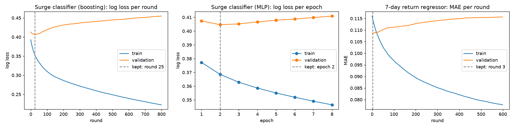
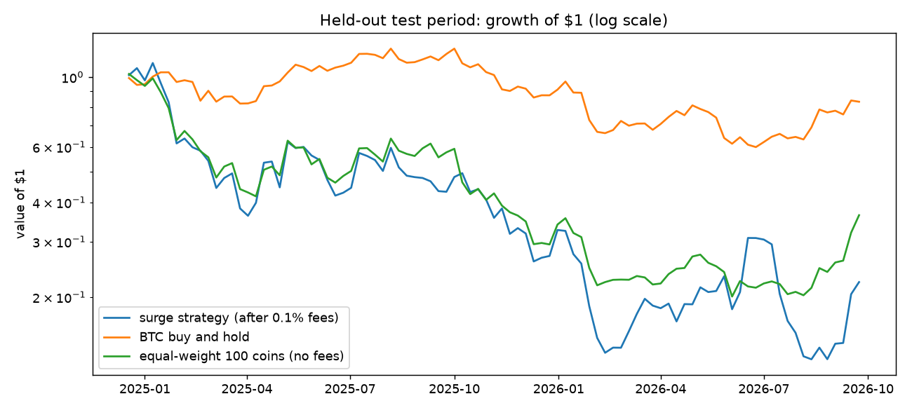

# Crypto Surge Prediction


**Question:** can technical indicators predict which coins will rise **15% or more in the
next 7 days**?

**Data:** the complete daily history of 100 coins traded against USDT on Binance, from
2017-08-17 to 2026-10-03 (191,480 daily candles). The models were tested on 21 months
they never saw, and the signal was traded in a fee-adjusted backtest.

**Answer: no, not in a way you could trade.** On the held-out period the best model
reaches ROC-AUC 0.53 (0.50 is a coin flip). Trading its signal lost 77.7% after fees,
worse than buying BTC (−16.6%) and worse than picking the same number of coins at random
(−69.2%). The same features *do* carry a modest signal for *whether* a coin will make a
big move in either direction (ROC-AUC 0.60). They just can't tell you which way.

This repo documents that result with every number reproducible. It also ships a live
scanner (`/v1/scan`) that scores today's candles, so you can watch the model's
probabilities yourself.

## Data

| | |
|---|---|
| Source | Binance Spot public REST API, `GET /api/v3/klines` (interval `1d`) on `data-api.binance.vision`; no API key |
| Universe | 100 USDT spot pairs: the top by 24h quote volume on 2026-10-04 with at least 730 daily candles (stablecoins and leveraged tokens excluded) |
| History | every completed daily candle since each pair was listed: 2017-08-17 → 2026-10-03 |
| Rows | 191,480 candles; 181,880 labelled rows after warm-up and label windows |
| Fetched | 2026-10-04 05:23 UTC, file SHA-256 `32cb4376…899ed0` |
| Label | close 7 days later ≥ +15% vs today's close |

`python -m cryptosurge.download` rebuilds the dataset. Market data is not committed
(`data/` is gitignored); the coin list is stored in the model card.

**Features (38).** All computed from candles up to and including the scored day:
- Returns over 1, 3, 7, 14 and 30 days, and volatility over 7, 14 and 30 days.
- Price vs its 7/14/30/90-day averages, RSI-14, MACD, and Bollinger width and position.
- High-low range, volume and trade-count z-scores, and the taker-buy ratio.
- Days since listing.
- Market-wide return, volatility and breadth; BTC return, volatility and volume share.
- Volume rank, and return relative to the market.

`test_features_do_not_use_future_candles` checks that adding future candles never changes
a past feature.

## Method

Chronological split, with a 7-day embargo between periods so no label window crosses
into the next period:

| Period | Dates | Rows | Surge rate |
|---|---|---|---|
| Train | 2017-11-14 → 2023-08-12 | 74,406 | 13.49% |
| Validation | 2023-08-20 → 2024-12-10 | 41,460 | 14.47% |
| **Test (used once)** | **2024-12-18 → 2026-09-26** | **64,789** | **9.00%** |

The validation period chooses the boosting round, the MLP epoch and the decision threshold
(the one with the best F1). Nothing is tuned on the test period.

| Model | Training | Stopped at |
|---|---|---|
| Logistic regression | L-BFGS on standardized features | 71 iterations |
| **Gradient boosting** (shipped) | up to 800 rounds, validation log loss recorded every round | best round **25** (validation log loss 0.4068) |
| MLP (64-32) | mini-batch Adam, 1,024 per batch, patience 6 | best epoch **2** of 8 |
| Return regressor (boosting, absolute error) | up to 600 rounds | best round 3 |

The very early stopping points are themselves a finding. Validation loss starts rising
almost immediately, because the patterns the models fit in 2017-2023 don't carry forward.



## Results on the held-out test period

| Model | Accuracy | Precision | Recall | F1 | ROC-AUC | PR-AUC | Log loss | Brier |
|---|---|---|---|---|---|---|---|---|
| Always "no surge" | 91.00% | n/a | 0.00% | 0.0000 | 0.5000 | 0.0900 | 0.3122 | 0.0839 |
| Logistic regression | 74.68% | 9.98% | 22.60% | 0.1385 | 0.5384 | 0.0995 | 0.3087 | 0.0833 |
| **Gradient boosting** | 65.41% | 9.87% | 34.98% | 0.1540 | 0.5287 | 0.0984 | 0.3076 | 0.0832 |
| MLP | 72.78% | 9.84% | 24.78% | 0.1408 | 0.5164 | 0.0962 | 0.3147 | 0.0841 |

How to read this:
- Surges were 9.00% of test rows, and every model's precision is about 10%. A "surge"
  flag is right about as often as picking at random.
- The 91% accuracy of "always no surge" shows why accuracy is the wrong metric for rare
  events.
- The models were much better in-sample. Gradient boosting has ROC-AUC 0.7809 on train,
  0.6234 on validation, and 0.5287 on test.

Gradient boosting confusion matrix on test (threshold 0.122): 40,337 TN, 18,620 FP,
3,792 FN, 2,040 TP.

**7-day return regression (test):**
- Mean absolute error is 0.0975, against 0.0982 for always predicting 0%.
- RMSE is 0.1604.
- The direction is right 56.17% of the time.
- The mean daily rank correlation with realised returns is 0.0291, and it's positive on
  53.85% of days.

**Big move in either direction (|7-day return| ≥ 15%), same features (test):**
- ROC-AUC 0.6036 and PR-AUC 0.2740, against a base rate of 19.53%.
- At the validation-chosen threshold: precision 26.32%, recall 50.10%.

That's a real but modest volatility signal.

## Business test: trading the signal

Every 7 days, buy (equal weight) up to 5 coins with surge probability ≥ 0.122, hold for
7 days, then sell. Each buy and each sell pays Binance's standard 0.1% spot fee.

| 2024-12-18 → 2026-09-23 (93 weeks) | Total return | Annualised | Volatility | Sharpe | Max drawdown |
|---|---|---|---|---|---|
| **Surge strategy (after fees)** | **−77.68%** | −56.87% | 102.45% | −0.33 | −88.55% |
| Random coins, same count, same fees | −69.20% | −48.33% | 66.87% | −0.65 | −83.02% |
| Equal-weight all 100 coins (no fees) | −63.60% | −43.25% | 66.53% | −0.52 | −80.35% |
| BTC buy and hold | −16.55% | −9.64% | 39.25% | −0.06 | −51.32% |

- The strategy took 460 positions over 93 weeks. Only 12.83% of picks rose 15% or more,
  40.00% were positive, and the median pick returned −2.74% before fees.
- The test period was a falling market for most coins (the 100-coin basket lost 63.60%),
  so every long-only approach lost money. The strategy lost the most.



## Live scanner

```bash
pip install -r requirements-dev.txt
PYTHONPATH=src uvicorn cryptosurge.api:app --port 8000
```

- `GET /`: a page with the live ranking and the held-out metrics above.
- `GET /v1/scan?top=20`: downloads the last 150 daily candles of all 100 coins from
  Binance, rebuilds the features and scores the latest completed day. Results are cached
  for 30 minutes.
- `GET /v1/stats`: the model card (test metrics and backtest).

Given the results above, treat `signal: true` as "the model's top picks", not as advice.
`vercel.json` pins the function to the Mumbai region (`bom1`), because Binance blocks
requests from some US regions.

## Reproduce

```bash
python -m cryptosurge.download --out data       # about 2 minutes
python -m cryptosurge.train --data-dir data     # about 2 minutes on a laptop CPU
```

The numbers in this README come from `reports/metrics.json` (run time 104 s on a Ryzen 7
7445HS). Retraining on a later download moves the test window and will change them.

## Tests

`pytest --cov=src`: 15 tests, 65% line coverage, run offline in CI on Python 3.11-3.13.
They use a fixture of 200 real Binance daily candles for 6 coins (2026-03-18 →
2026-10-03). They cover:
- Label correctness against the real forward return.
- No look-ahead in features.
- The embargoed split.
- Backtest arithmetic checked by hand against real returns.
- Binance response parsing and host fallback.
- The API, including upstream failure.

## Limitations

- **Survivorship bias.** The universe is today's 100 most-traded coins. Coins that
  collapsed or were delisted before today are missing, which flatters every long-only
  backtest, including the benchmarks.
- One exchange (Binance), daily candles only, no order-book or on-chain data.
- `WBTCUSDT` (wrapped BTC) is in the universe and moves almost exactly with `BTCUSDT`.
- The backtest assumes fills at the daily close, and models no slippage beyond the 0.1% fee.

## License

MIT. Market data © Binance, used via its public API.
